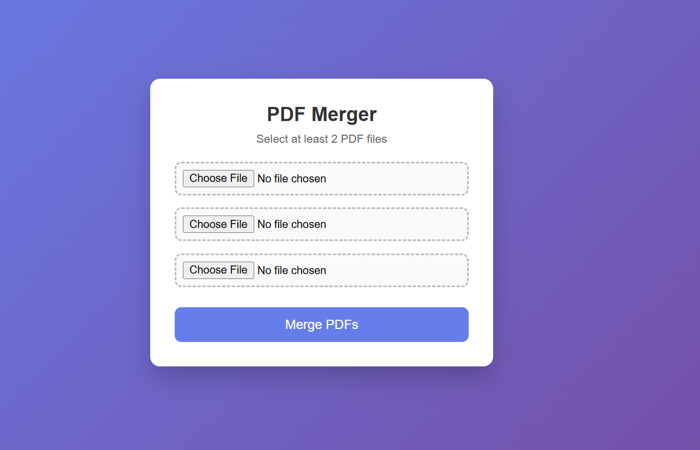

# PDF Merger – Flask Web App

A simple Flask-based web application that allows users to upload and merge multiple PDF files into a single PDF.

## 🚀 Live Demo
https://pdf-merger-8c86.onrender.com

## 🛠 Tech Stack
- Python
- Flask
- PyPDF2
- HTML
- CSS
- Render (Deployment)

## 📸 Screenshot

## ✨ Features
- Upload multiple PDF files
- Merge PDFs into one
- Clean and responsive UI
- Deployed on Render (Free tier)

